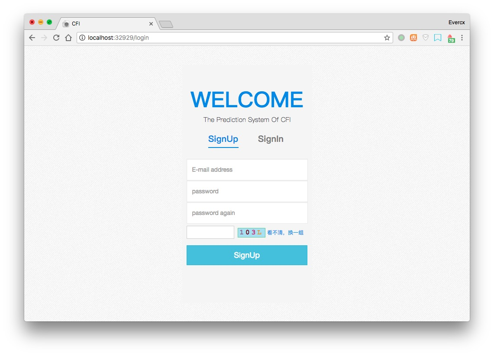
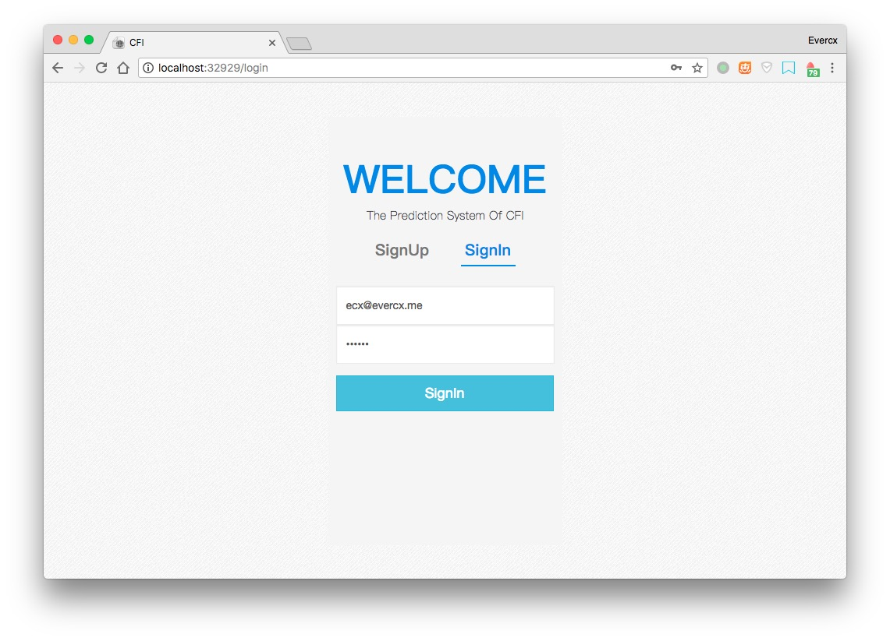
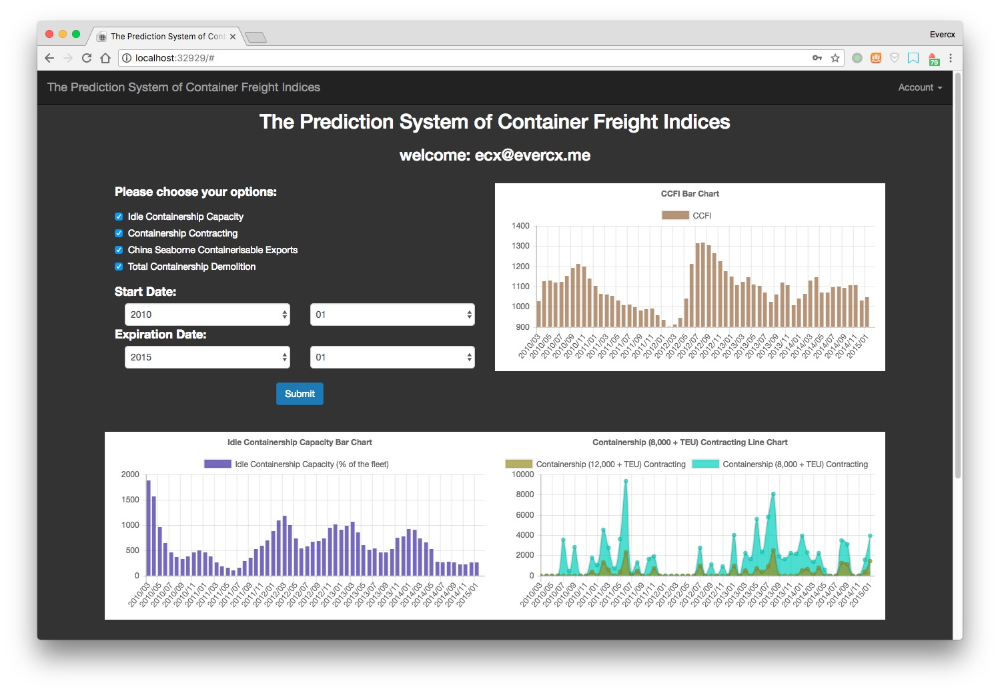
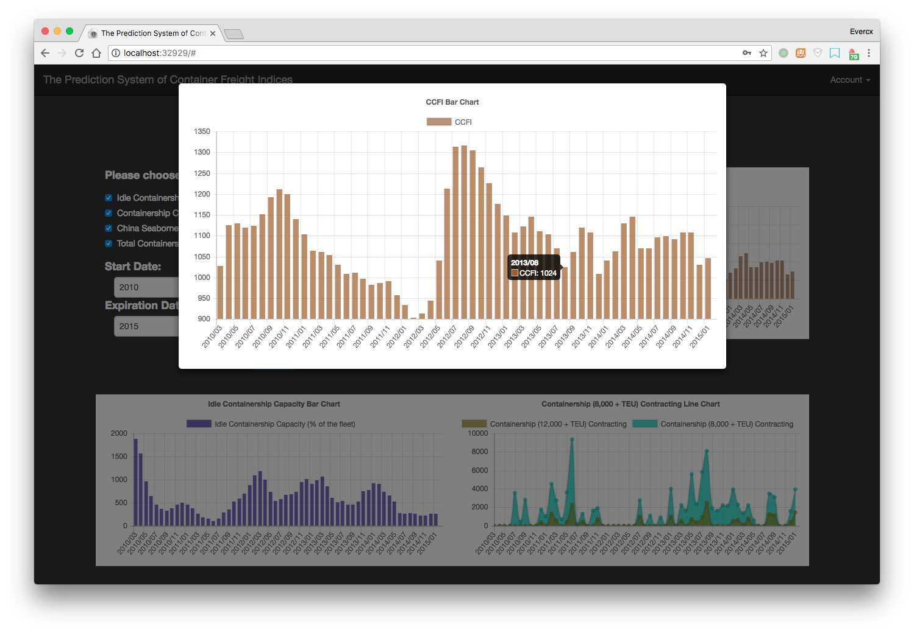

# 集装箱运价指数统计预测

## 简介

根据近年来的集装箱运价进行统计，并且基于机器学习算法来进行未来运价的预测。

本项目在这些数据的基础上建立了可视化前端页面。

## 技术

数据库：MongoDB

后端框架：Node.js — Express 

数据库模块：mongoose

HTTP请求：superagent

前端UI：BootstrapUI + Chart.js

前端逻辑：jQuery + Ajax

## 演示

